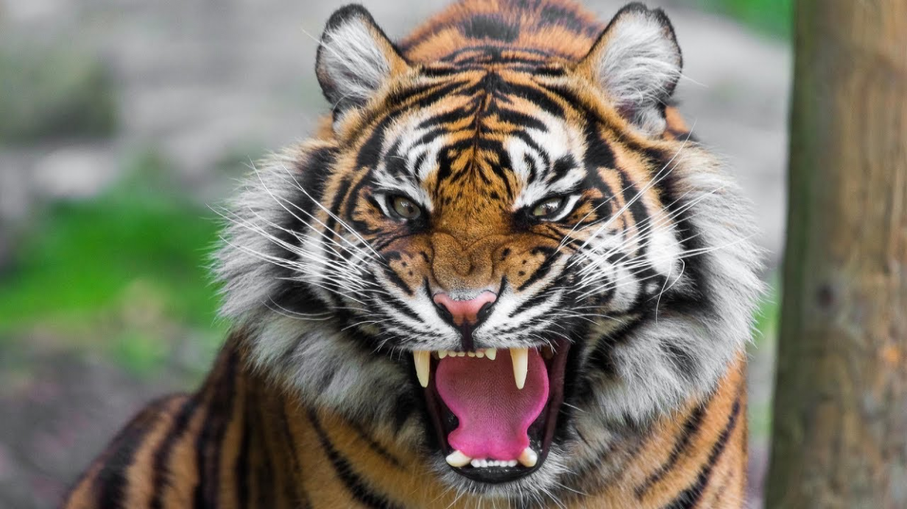
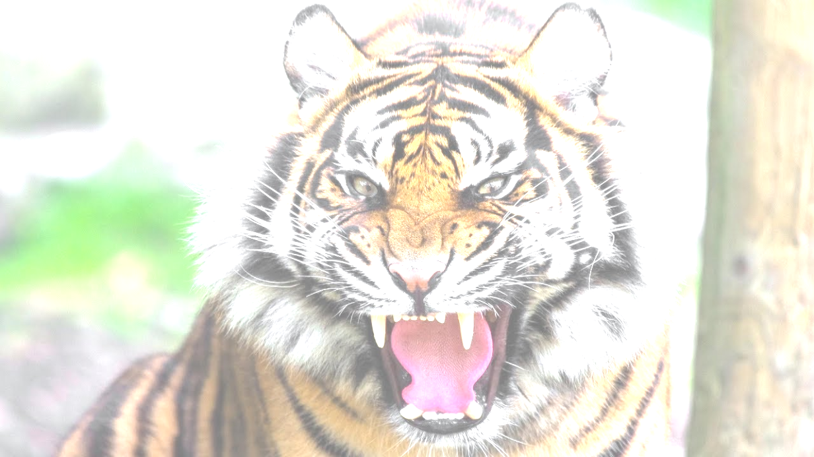
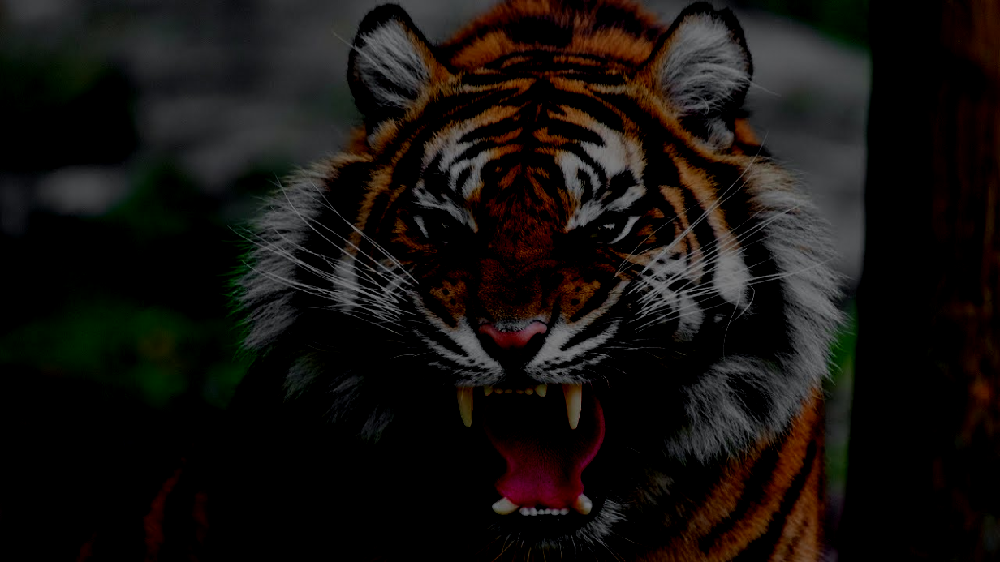
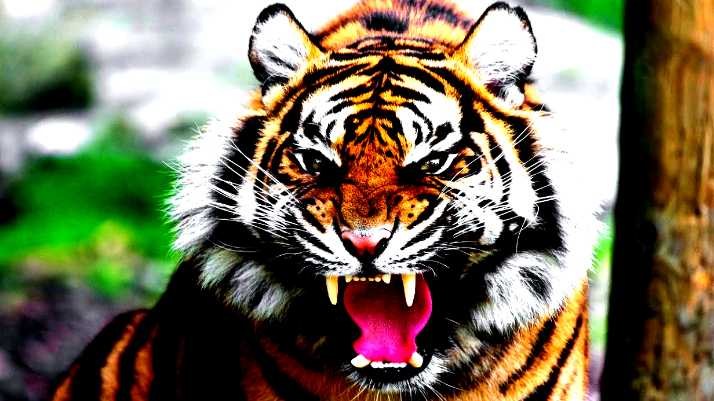
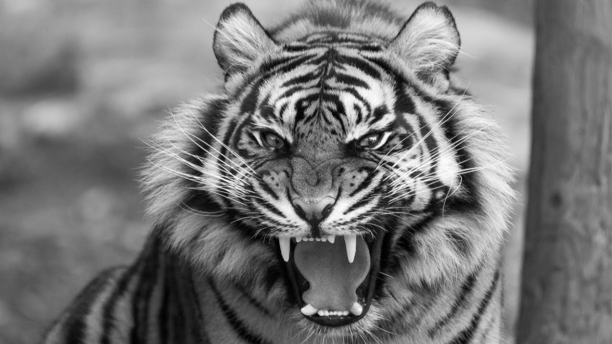
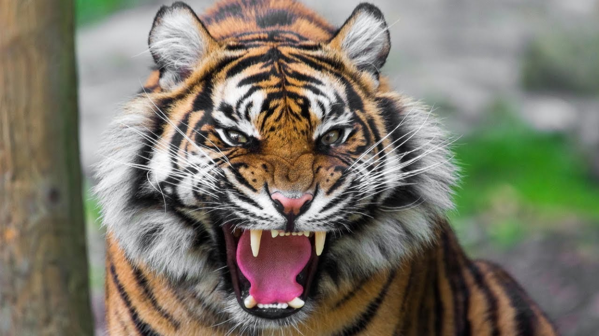
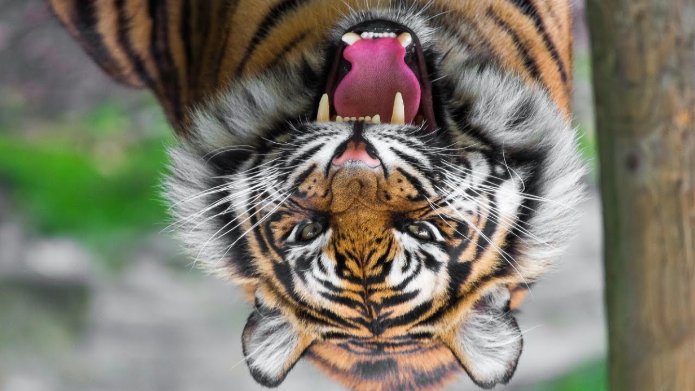
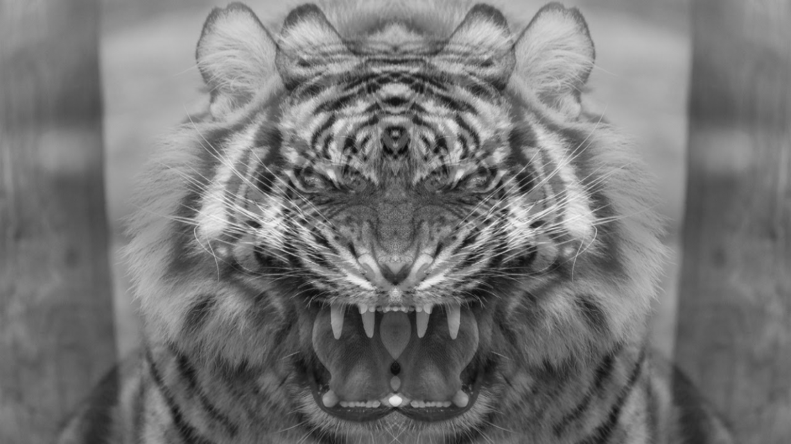

# Image Processing Project

## Thông tin

* **Họ và tên:** Bùi Vũ Hiếu Phụng
* **MSSV:** 18127185
* **Các chức năng**

|            Chức năng             | Tiến độ |
| :------------------------------: | :-----: |
|         Thay đổi độ sáng         |  100%   |
|      Thay đổi độ tương phản      |  100%   |
| Chuyển đổi ảnh RGB thành ảnh xám |  100%   |
|        Lật ảnh ngang/dọc         |  100%   |
|  Chồng hai ảnh cùng kích thước   |  100%   |
|            Làm mờ ảnh            |  100%   |

-----------------------------------------

## Mô tả

* **Ảnh gốc**

### Thay đổi độ sáng

#### Ý tưởng thực hiện

* Để tăng độ sáng ảnh lên 1 độ $k\in [-255,\ 255]$, ta cộng từng điểm ảnh với scalar $k$ đó
  * Với điểm ảnh $v =\begin{bmatrix} v_1 & v_2 & v_3 \end{bmatrix}$, tăng độ sáng lên thì điểm ảnh mới là $v' =\begin{bmatrix} v_1+k & v_2+k & v_3+k \end{bmatrix}$
  * Ở trường hợp điểm ảnh sau khi được cộng bị tràn khỏi khoảng giá trị RGB là $[0,\ 255]$ thì ta ép kiểu ảnh hoặc scalar về `int16`. Nếu sau khi cộng:  
    * $v_i<0$ thì $v_i=0$
    * $v_i>255$ thì $v_i=255$
* Trong source code:
  * Chuyển scalar về `np.ndarray` rồi ép kiểu về `int16` để không phải ép kiểu toàn ảnh (trong trường hợp ảnh lớn). Sau đó dùng phép $+$ để tận dụng array broadcasting của `numpy`
  * Dùng hàm `np.clip` để giới hạn giá trị của điểm ảnh

#### Hình ảnh kết quả

* **Với độ sáng $+128$:**

* Với độ sáng $-128$:

### Thay đổi độ tương phản

#### Ý tưởng thực hiện

* Để tăng độ tương phản lên 1 độ $k\in[-255,\ 255]$, ta nhân từng điểm ảnh với scalar $factor$ được tính theo công thức: $factor=\frac{259*(k+255)}{255*(259-k)}$ và $factor$ thuộc kiểu dữ liệu `float`

  Để ảnh đẹp hơn ta nhân theo công thức sau: $v_i=factor*(v_i-128)+128$

  * Ở trường hợp điểm ảnh sau khi được nhân bị tràn khỏi khoảng giá trị RGB là $[0,\ 255]$ thì nếu sau khi nhân:  
    * $v_i<0$ thì $v_i=0$
    * $v_i>255$ thì $v_i=255$
* Trong source code:

  * Chuyển ảnh về kiểu `float`. Sau đó dùng phép $*$ để tận dụng array broadcasting của `numpy`
  * Dùng hàm `np.clip` để giới hạn giá trị của điểm ảnh

#### Hình ảnh kết quả

* **Với độ tương phản $+128$:**

* **Với độ tương phản $-128$:**

### Chuyển đổi ảnh RGB thành ảnh xám

#### Ý tưởng thực hiện

* Để chuyển ảnh RGB thành ảnh xám, có hai cách: phương pháp lấy trung bình hoặc phương pháp dùng trọng số. Ở đây em chọn phương pháp thứ hai
  * Với trọng số $weight =\begin{bmatrix} w_r & w_g & w_b \end{bmatrix}$, ta có công thức: $image=w_r*R+w_g* G+w_b*B$
    * Trọng số $weight$ có thể được chọn trong [link](https://en.wikipedia.org/wiki/Luma_(video))
  * Với mỗi điểm ảnh, nhân vô hướng nó với mảng trọng số $weight$
* Trong source code:
  * `img[..., 3]` để slide từng điểm ảnh, rồi dùng `np.dot` để tìm tích vô hướng của điểm ảnh với trọng số
  * Vì ảnh xám chỉ có một kênh màu duy nhất nên để hiển thị được trên notebook ta dùng tham số `cmap='gray'` của `matplotlib.pyplot`

#### Hình ảnh kết quả

### Lật ảnh

#### Ý tưởng thực hiện

* Ảnh được lưu bằng ma trận từng điểm ảnh nên chỉ cần lật ma trận theo hướng mong muốn thì ta được ảnh đã được lật
* Trong source code:
  * Để lật ngang, dùng `np.fliplr`
  * Để lật dọc, dùng `np.flipud`

#### Hình ảnh kết quả

* **Lật ngang**

* **Lật dọc**

### Chồng hai ảnh cùng kích thước

#### Ý tưởng thực hiện

* Chồng hai ảnh cùng kích thước với độ trong suốt của ảnh đầu tiên là $\alpha$ và ảnh thứ hai là $1-\alpha$
  * Cộng ($+$) hai ảnh đã được điều chỉnh độ trong suốt bằng phép $*$
* Trong source code:
  * Thực hiện phép nhân và cộng như đã trình bày ở các chức năng trên
  * Vì làm trên ảnh xám nên kết quả cùng là ảnh xám, do đó phải dùng `cmap='gray'` để hiển thị ảnh kết quả

#### Hình ảnh kết quả

* $alpha=0.5$, ảnh 2 là ảnh 1 được lật ngang

### Làm mờ ảnh

#### Ý tưởng thực hiện

* Thực hiện các bước sau:
  * Tìm Gaussian filter kernel:
    * Công thức Gaussian (phân phối chuẩn): $f(x)=\frac{1}{\sqrt{2\pi}}\cdot e^{-\frac{1}{2}(\frac{x-\mu}{\sigma})^2}$. Ở đây $\mu=0$ và $\sigma=\frac{\text{kernel_size}-1}{6}$
    * Dàn đều giá trị từ $-\frac{\text{kernel_size}}{2}$ đến $+\frac{\text{kernel_size}}{2}$ với số điểm trong mảng là $\text{kernel_size}$
    * Tính giá trị phân phối chuẩn của mỗi phần tử của mảng trên bằng công thức Gaussian
    * Từ kernel 1 chiều này, tạo kernel 2 chiều bằng cách nhân cho chuyển vị của nó: $K_2 = (K_1)*(K_1)^T$ 
    * Chuẩn hóa kernel để tổng các phần tử trong kernel $= 1$ bằng cách nhân từng phần tử với nghịch đảo của tổng này
  * Tích chập từng kênh màu với kernel
    * Cắt mảng nhỏ từ mảng kênh màu lớn
    * Nhân vô hướng giữa kernel và mảng nhỏ, trả về giá trị trung tâm của mảng nhỏ trên ảnh 
  * Hợp kênh màu lại thành ảnh
* Trong source code:
  * `np.linspace` để dàn giá trị
  * `np.outer` để thực hiện phép $K_2 = (K_1)*(K_1)^T$ 
  * `np.sum` để tính tổng các phần tử trong ma trận
  * `np.subtract` để tính hiệu các phần tử trong ma trận
  * `np.lib.stride_tricks.as_strided` ????????????????
  * `np.einsum` ??????????????????????????????
  * `np.dstack` để gộp các kênh màu lại thành ảnh

#### Hình ảnh kết quả

* kernel size $=15$

---------------------------------------------------

## Tham khảo

* [Độ sáng ảnh](https://www.dfstudios.co.uk/articles/programming/image-programming-algorithms/image-processing-algorithms-part-5-contrast-adjustment/)
* [Công thức contrast](https://www.dfstudios.co.uk/articles/programming/image-programming-algorithms/image-processing-algorithms-part-5-contrast-adjustment/)
* [Tham số weight](https://en.wikipedia.org/wiki/Luma_(video))
* [Công thức grayscale](https://www.tutorialspoint.com/dip/grayscale_to_rgb_conversion.htm)
* Một số implementation và tips của Gausian blur:
  * https://www.adeveloperdiary.com/data-science/computer-vision/applying-gaussian-smoothing-to-an-image-using-python-from-scratch/
  * https://stackoverflow.com
  * [Chọn sigma theo kernel](https://stackoverflow.com/questions/3149279/optimal-sigma-for-gaussian-filtering-of-an-image)
  * https://en.wikipedia.org/wiki/Gaussian_blur